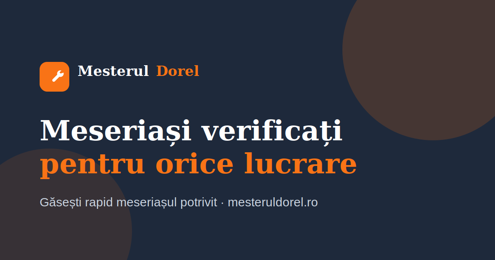

# Mesterul Dorel 🔨

> **„Găsești rapid meseriașul potrivit.”**

Platformă de servicii la domiciliu care conectează clienții cu meseriași verificați din România — instalatori, electricieni, zugravi, montatori și mulți alții. Proiect MVP, gata pentru lansare, construit cu un stack modern și o arhitectură pregătită pentru producție.



---

## ✨ Funcționalități

- **Home** — hero cu căutare (ce ai nevoie + oraș), categorii populare, meseriași recomandați, „cum funcționează”, recenzii, CTA.
- **Categorii** — grid cu toate serviciile, fiecare cu icon dedicat.
- **Listare meseriași** — filtrare după oraș, categorie, preț, rating și disponibilitate + sortare, totul pe client.
- **Profil meseriaș** — poză, specializări, descriere, galerie lucrări, recenzii cu distribuție pe stele, disponibilitate, „Solicită ofertă” (modal cu validare).
- **Publică o lucrare** — formular complet validat cu **Zod** + **React Hook Form** (titlu, descriere, buget, oraș, adresă, telefon, fotografii).
- **Dashboard client** — lucrări active, oferte primite, mesaje, recenzii.
- **Dashboard meseriaș** — cereri noi, oferte trimise, calendar, încasări, editare profil.
- **Mesagerie** — UI mock de chat client ↔ meseriaș, în timp real (local).
- **Notificări** — UI mock pentru cerere nouă / ofertă nouă / mesaj nou / recenzie.
- **Autentificare** — login + înregistrare cu roluri (Client / Meseriaș), pregătit pentru Supabase Auth.
- **SEO** — `metadata`, Open Graph, `sitemap.xml`, `robots.txt`, texte în limba română.
- **Responsive mobile-first**, carduri elegante, umbre subtile, mult spațiu alb.

---

## 🛠️ Stack tehnologic

| Tehnologie | Rol |
|---|---|
| **Next.js 15** (App Router) | framework + rutare + SSG/SSR |
| **TypeScript** | tipare stricte |
| **Tailwind CSS** | stilizare utility-first |
| **shadcn/ui** + **Radix UI** | componente accesibile |
| **React Hook Form** + **Zod** | formulare + validare |
| **lucide-react** | iconuri |

### Pregătit pentru integrare ulterioară
Arhitectura izolează datele în spatele unui **service layer** (`src/services`) cu funcții `async`, astfel încât trecerea la backend real să nu necesite modificări în UI:

- **PostgreSQL + Prisma** — înlocuiește `src/lib/data/*` cu interogări în `src/services/*`.
- **Supabase Auth** — implementează stub-urile din `src/services/auth-service.ts`.
- **Stripe** — modul de plăți/încasări (vezi tab-ul „Încasări” din dashboard-ul meseriașului).

Variabilele de mediu necesare sunt documentate în [`.env.example`](.env.example).

---

## 🚀 Instalare și rulare

Cerințe: **Node.js 18.18+** (recomandat 20/22) și npm.

```bash
# 1. Intră în folder
cd website

# 2. Instalează dependențele
npm install

# 3. (opțional) creează fișierul de mediu
cp .env.example .env.local

# 4. Pornește serverul de dezvoltare
npm run dev
```

Deschide [http://localhost:3000](http://localhost:3000).

### Scripturi disponibile
```bash
npm run dev        # server de dezvoltare
npm run build      # build de producție
npm run start      # rulează build-ul de producție
npm run lint       # ESLint
npm run typecheck  # verificare tipuri TypeScript
```

---

## 📁 Structura proiectului

```
src/
├── app/                        # App Router (pagini + SEO)
│   ├── layout.tsx              # layout global, metadata, navbar/footer
│   ├── page.tsx                # Home
│   ├── categorii/              # pagina Categorii
│   ├── meseriasi/              # listare + [slug] profil
│   ├── publica-lucrare/        # formular publicare lucrare
│   ├── dashboard/              # client/ + meserias/
│   ├── autentificare/          # login + register
│   ├── sitemap.ts · robots.ts  # SEO
│   └── icon.svg · not-found.tsx
│
├── components/
│   ├── ui/                     # primitive shadcn (button, card, dialog...)
│   ├── layout/                 # navbar, footer
│   ├── home/                   # hero, how-it-works
│   ├── meseriasi/              # card, filtre, explorare, dialog ofertă
│   ├── lucrari/                # formular lucrare
│   ├── dashboard/              # dashboards, chat, notificări, stat-card
│   ├── auth/                   # formular autentificare
│   └── shared/                 # logo, rating, review-card, category-card...
│
├── services/                   # layer de date (mock azi → DB mâine)
│   ├── meseriasi-service.ts
│   └── auth-service.ts         # stub Supabase
│
├── hooks/                      # use-filtre-meseriasi
├── lib/
│   ├── data/                   # MOCK DATA (vezi mai jos)
│   ├── utils.ts                # cn, formatRON, formatData, slugify...
│   ├── validations.ts          # scheme Zod
│   ├── constants.ts            # brand, orașe
│   └── icons.tsx               # mapare iconuri categorii
└── types/                      # tipuri partajate
```

### 🗂️ Date demo (mock)
Toate datele demo sunt în fișiere separate în `src/lib/data/`:

| Fișier | Conținut |
|---|---|
| `categorii.ts` | **13 categorii** de servicii |
| `meseriasi.ts` | **20 meseriași** fictivi |
| `recenzii.ts` | **10 recenzii / meseriaș** (200 în total) |
| `lucrari.ts` | **10 lucrări** demo + oferte |
| `mesagerie.ts` | conversații + notificări |

> Datele sunt complet izolate. Pentru a conecta o bază de date reală, modifică doar `src/services/*`.

---

## 🎨 Design

Identitate vizuală inspirată din TaskRabbit / Thumbtack / Fiverr:

- **Portocaliu** `#F97316` (accent / brand)
- **Albastru închis** `#1E293B` (text / suprafețe închise)
- **Alb** + **gri foarte deschis** (fundaluri)
- carduri cu colțuri rotunjite, umbre subtile, layout aerisit, mobile-first.

---

## 📌 Note

Acesta este un **MVP** cu date mock. Fluxurile de trimitere (publicare lucrare, solicitare ofertă, autentificare, chat) sunt simulate pe client și marcate cu `// TODO` / `// mock` acolo unde urmează integrarea cu backend-ul real.

© Mesterul Dorel — proiect demonstrativ pregătit pentru lansare în România.
